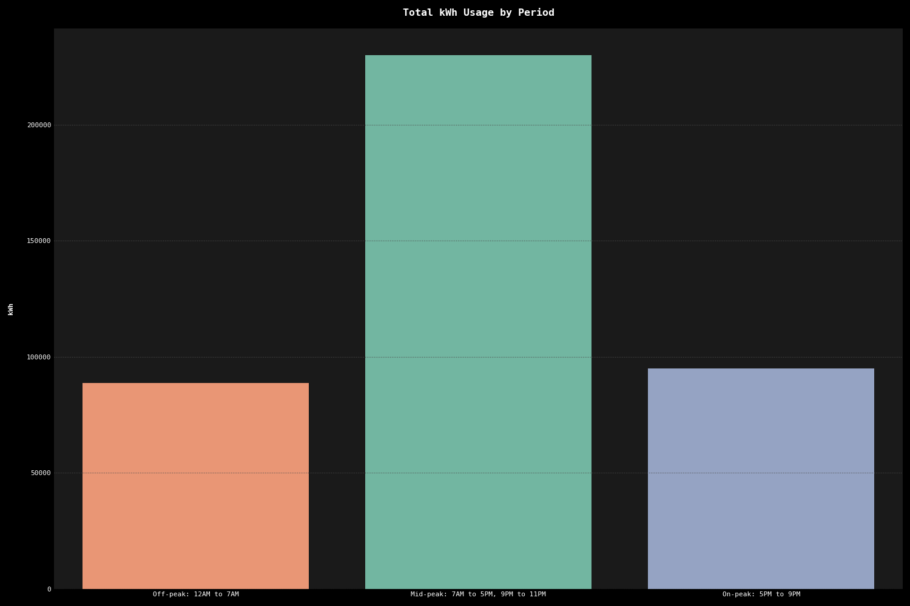

<!-- omit in toc -->
# Explortatory Data Analysis  

<!-- omit in toc -->
## Table of Contents

- [Introduction](#introduction)
- [Installation \& Usage](#installation--usage)
  - [Setting Up the Environment](#setting-up-the-environment)
- [General Information](#general-information)
- [Feature Engineering](#feature-engineering)
- [High-Level Meter Analyses](#high-level-meter-analyses)
  - [Distribution of kWh by Meter ID \& Year](#distribution-of-kwh-by-meter-id--year)
  - [kWh Usage Over Time by Meter ID](#kwh-usage-over-time-by-meter-id)
  - [kWh Usage at Each Location](#kwh-usage-at-each-location)
  - [Key Takeaways](#key-takeaways)
- [Usage by Period](#usage-by-period)
  - [Key Takeaways](#key-takeaways-1)
- [Mean and Max Usage Analysis](#mean-and-max-usage-analysis)
  - [Plot Aggregations](#plot-aggregations)
  - [Key Takeaways](#key-takeaways-2)
- [Energy Spikes](#energy-spikes)
  - [Key Takeaways](#key-takeaways-3)

## Introduction

The following is an exploratory data analysis of energy usage data for Austin Street Brewery Company. The raw data has been procured directly from Central Maine Power (CMP), which is Austin Street's principal energy supplier. 

## Installation & Usage

This project utilizes [**Conda**](https://docs.conda.io/en/latest/) for managing dependencies and environments. Conda enables the creation of isolated environments that can house specific versions of packages, making it easier to manage complex projects. It's particularly well-suited for Python-based data science projects, ensuring that all dependencies are compatible and can be easily installed or removed.

### Setting Up the Environment

For the shortest path to getting up and running, you can simply run the command below, which will create the Conda environment and run commands for each EDA script generated for this project:

```bash
make setup
```  

Charts can then be created and reviewed using one of the following commands:

```bash
make eda1
make eda2
```

Note that each plot is then saved as a PNG file in the `.fig` directory after being closed by the user. 

## General Information

The primary source of exploration is a compilation of CMP energy usage data for the 7 meters associated with Austin Street Brewery Company. The are 5 columns and 500,279 rows. There is no missing data.

The data being analyzed has been extracted directly from the consumer-facing portal at *cmpco.com*. It has been structured and optimized using the Parquet format. This [README](data/README.md) provides a brief rationale for our data storage decisions and describes some of the retrieval paradigms used with `pandas` and `pyarrow`. 

The location for this source's Parquet directory can be found [here](data/cmp/curated/meter-usage). To facilitate smooth development and execution as reproducibility, all commands are run out of the Conda environment created for the project, `electric-brew`. The **PYTHONPATH** for this environment is set to point directly to the `src` directory within this project's folder structure. This allows all scripts to easily import the `utils` module and its included DataFrames and functions from any script within the `src` directory, including `meter_usage`.

**Schema** 

  - `service_point_id` (**int**): A unique identifier for the point where the electrical service is provided, often tied to a specific location or customer.
  
  - `meter_id` (**str**): Identifier for the electrical meter installed at the service point. It records the amount of electricity consumed.
  
  - `interval_end_datetime` (**str**): Timestamp marking the end of the meter reading interval, typically indicating when the meter was read.
  
  - `meter_channel` (**int**): The channel number on the electrical meter. Meters with multiple channels can record different types of data.
  
  - `kwh` (**float**): Kilowatt-hours recorded by the meter during the interval, representing the unit of electricity consumed.

  - `account_number` (**int**): A unique identifier for the customer's account with CMP.

**Sample**

Using `.head()` on `meter_usage` yields the following results:

|    |   service_point_id | meter_id   | interval_end_datetime   |   meter_channel |   kwh |   account_number |
|---:|-------------------:|:-----------|:------------------------|----------------:|------:|-----------------:|
|  0 |         2300822246 | L108605388 | 10/1/2022 12:00:00 AM   |              10 | 0.594 |      30010320353 |
|  1 |         2300822246 | L108605388 | 10/1/2022 12:15:00 AM   |              10 | 0.101 |      30010320353 |
|  2 |         2300822246 | L108605388 | 10/1/2022 12:30:00 AM   |              10 | 0.104 |      30010320353 |
|  3 |         2300822246 | L108605388 | 10/1/2022 12:45:00 AM   |              10 | 0.106 |      30010320353 |
|  4 |         2300822246 | L108605388 | 10/1/2022 1:00:00 AM    |              10 | 0.099 |      30010320353 |

## Feature Engineering

This section discusses the reformatting of existing columns and the generation of new ones to enable more in-depth analysis. 

  - `interval_date_time` (**datetime**): Converted to datetime datatype to facilitate time-based analysis. Enables granular, time-based comparisons and trend observations.
  
  - `year` (**int**): Year extracted from `interval_date_time` and added as a separate column. Useful for annual comparative analysis and identifying yearly trends.
  
  - `month` (**int**): Month extracted from `interval_date_time` and added as a separate column. Allows for monthly trend analysis and comparisons.
  
  - `month_name` (**str**): Full name of the month extracted for better readability in plots and reports.

  - `hour` (**int**): Hour extracted from `interval_date_time`. Useful for hourly trend analysis and period classification.

  - `period` (**str**): Classifies the time of the day into three categories: 'Off-peak: 12AM to 7AM', 'Mid-peak: 7AM to 5PM, 9PM to 11PM', and 'On-peak: 5PM to 9PM'. This classification aids in understanding the energy usage patterns based on different time periods.

  - `location` (**str**): Maps the `account_number` to a physical location name. This new column aids in spatial analysis and allows for color-coding plots by location for better interpretability.
  
  - `kwh_normalized` (**float**): Normalized energy usage, calculated as $\frac{{\text{kWh} - \mu}}{{\sigma}}$ where $\mu$ is the mean and $\sigma$ is the standard deviation, both computed grouped by `meter_id`. This normalization levels the playing field for analysis, allowing for a fair comparison across different meters and times.
  
  - `extreme_outlier` (**bool**): Boolean flag indicating if `kwh_normalized` is greater than 3 or less than -3. Serves as an immediate and accessible flag for unusual or extreme energy usage patterns.

## High-Level Meter Analyses

This section examines the energy consumption patterns over time, focusing on the different meter IDs. It incorporates two types of visualizations: boxplots that aggregate data by years and scatter plots that offer granular looks at the kWh usage over the entire observed timeframe.

### Distribution of kWh by Meter ID & Year

This plot presents a series of boxplots, each representing the distribution of normalized kilowatt-hour (kWh) usage by meter ID for different years. It aims to provide insights into the variability, central tendency, and outliers in the energy consumption recorded by each meter ID annually.


### kWh Usage Over Time by Meter ID

Rather than group by year, this scatter plot illustrates the kilowatt-hour (kWh) usage over time, with each meter ID represented by a unique color. The plot aims to highlight trends, outliers, and patterns in energy consumption for each meter ID throughout the observed time frame.


### kWh Usage at Each Location

After analyzing the kWh usage over time by Meter ID, the next logical step is to examine how this usage is distributed across the brewery's 2 locations. This new dimension offers insights into whether specific locations are more energy-efficient or if they encounter different challenges in terms of energy management.


### Key Takeaways

1. **Location-Specific Energy Spikes**: While energy consumption spikes occur across all meters and both brewery locations, the data shows a higher mean and max kWh usage at Fox Street compared to Industrial Way. The mean kWh at Fox Street is 0.912 and 0.642 at Industrial Way, indicating a more significant energy demand at Fox Street. This differential suggests that if there are opportunities for using energy more efficiently, those strategies may need to be tailored to each location rather than being uniformly applied across the company.

2. **Direct and Long-Term Cost Implications**: The spikes in energy usage at Fox Street, with a max kWh usage of 19.944, are notably higher than at Industrial Way, with a max kWh usage of 11.061. These spikes are not merely statistical outliers; they have immediate and long-term financial ramifications, including the risk of pushing the brewery into a higher tariff bracket. This is particularly concerning for Fox Street, where the energy demand is significantly higher, inflating energy costs over an extended period.

3. **Differential Systemic Nature of Spikes**: Spikes in energy usage are indeed a systemic issue affecting all meters and years. However, the differential mean and max kWh between Fox Street and Industrial Way indicate that the issue manifests differently at each location. This requires a more in-depth, location-specific analysis of how the energy grid and machinery interact to better utilize space and grid, thereby offering a protective buffer against unexpected, costly spikes in energy demand.

4. **Customized Energy Efficiency Plans**: Given the different energy demands at each location, customized energy-saving measures could be more effective than a generalized strategy. For instance, Fox Street, with its higher energy demand, could benefit more from rescheduling equipment to operate during off-peak hours or investing in energy-efficient machinery. Such targeted strategies could offer more substantial cost savings and operational efficiencies for each location.

## Usage by Period

This section focuses on analyzing energy usage based on time-of-day categorization into three distinct periods: Off-peak, Mid-peak, and On-peak. The goal is to understand how energy consumption varies throughout the day and identify potential opportunities for optimizing energy costs in accessible buckets for the business.




### Key Takeaways

1. **High Mid-Peak Usage for Core Operations**: The Mid-peak period (7AM to 5PM, 9PM to 11PM) shows the highest energy consumption, which aligns with core operational hours for most breweries. This is typically when brewing processes—such as mashing, boiling, and fermentation control—are most active. The spike in usage during these hours may also coincide with administrative functions, quality checks, and perhaps even initial stages of packaging. While these processes are essential, the high energy consumption warrants an investigation into more energy-efficient machinery or operational adjustments to distribute energy usage more evenly throughout the day.

2. **Off-Peak Opportunities for Non-Essential Processes**: The Off-peak period (12AM to 7AM) shows the lowest energy usage, which is expected as most breweries would have scaled down operations during these hours. However, certain non-time-sensitive processes, like long-term fermentation control or batch mixing, could potentially be moved to these hours. Shifting some of these activities to off-peak times could leverage lower energy rates, leading to substantial cost savings without compromising on productivity or quality.

3. **On-Peak Caution for High-Cost Operations**: The On-peak period (5PM to 9PM) has energy usage that is almost as high as during Mid-peak hours, despite being a shorter time frame. This is concerning given that energy rates are often highest during this period. Breweries may be running end-of-day quality checks, clean-in-place (CIP) systems, or even late-shift brewing during these hours. Given the high cost of energy during this period, it would be prudent to review the necessity of these activities at these times and consider rescheduling or optimizing them to avoid increased rates that tend to correlate with peak usage for grids.

## Mean and Max Usage Analysis

This section delves into the analysis of mean and max energy usage by individual meters, categorized by month and year. The analysis aims to identify patterns, spikes, and potential areas for operational optimization. 

### Plot Aggregations

- `max_usage` (**float**): Represents the highest energy consumption in kilowatt-hours (kWh) recorded by each meter in 15-minute intervals, grouped by month and year. This metric is crucial for understanding the extreme peaks in energy usage, which can have both immediate and long-term financial ramifications, such as pushing the brewery into a higher tariff bracket.

- `mean_usage` (**float**): Represents the average energy consumption in kilowatt-hours (kWh) for each meter, also grouped by month and year. Understanding the mean usage helps to gauge the typical energy needs and offers a baseline for potential energy-saving strategies.

- `max_mean_diff` (**float**): Calculates the percent difference between `max_usage` and `mean_usage`. A high percent difference suggests spikes in energy usage that are not merely statistical outliers but have systemic implications. This uniform distribution of spikes across meters and years implies the need for a more in-depth analysis to better utilize space and grid.  


### Key Takeaways

1. **Operation-Induced Peaks**: The significant gap between `max_usage` and `mean_usage` suggests that the brewery experiences sporadic surges in energy demand. These could be attributed to high-energy processes like brewing cycles, sterilization, or refrigeration adjustments that are not continuous but occur at specific times. The `max_usage` captures these peaks, while the `mean_usage` offers a more 'typical' energy usage pattern. Understanding this disparity could be crucial for optimizing energy-intensive processes and, in turn, lowering overall operational costs.

2. **Strategic Mitigation**: The uniform nature of these spikes across all meters suggests that any mitigation strategies, such as energy-efficient initiatives or operational tweaks, could be applied company-wide.

3. **Operational Mapping**: The data calls for a deeper dive into the business operations linked to these usage spikes. Identifying the causes can lead to targeted strategies to mitigate their impact, thereby optimizing energy costs.

## Energy Spikes

Defining an energy spike as an interval where power usage exceeds $3 \sigma$ from the mean $\mu$ of `kwh` by `meter_id`, our dataset reveals **9,329** such instances out of its 500,000 recordings. While we will delve into the parameters and impacts in greater detail, this prevalence itself is noteworthy.

The subsequent visualizations aim to spotlight the frequency and temporal distribution of these energy spikes across individual meters.


### Key Takeaways

1. **Spike Frequency and Timing**: The frequency and timing of these spikes could reveal patterns tied to specific operational processes or schedules. Understanding when spikes are most likely to occur could inform better resource allocation or even preventative measures.

2. **Operational Constraints and Solutions**: The existence of multiple spikes indicates either operational inefficiency or a necessity dictated by the production cycle. Identifying the root cause could lead to tailored solutions, such as rescheduling high-energy processes to off-peak hours to capitalize on lower energy rates.

3. **Duration of Spikes**: Although not covered in this initial EDA, understanding the duration of these spikes could be critical. A prolonged spike might indicate a more systemic issue requiring a fundamental change, whereas short, frequent spikes could potentially be smoothed out via operational tweaks.

As this project advances, we will explore the duration and impact of these spikes in greater depth, aiming to offer actionable insights to mitigate their cost and operational implications.
